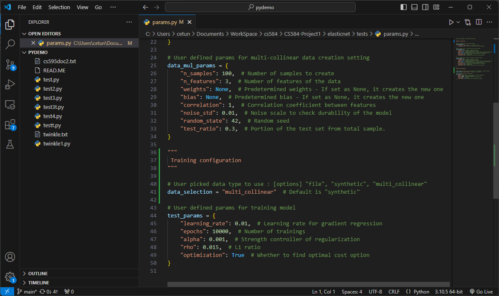
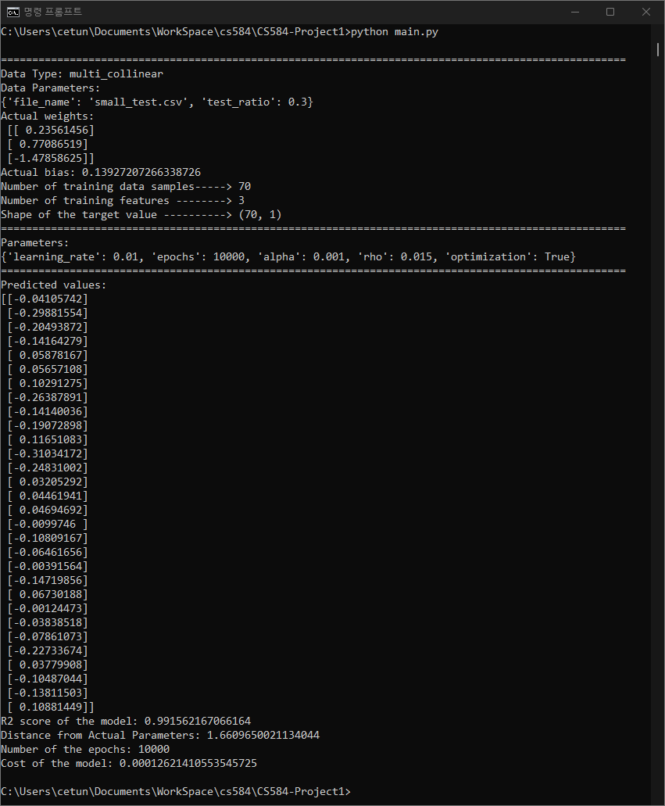

# Project 1 

### Creator Description
- Name: Haeun Suh
- HawkID: A20542585
- Class: CS584-04 Machine Learning(Instructor: Steve Avsec)
- Email: hsuh7@hawk.iit.edu

#### [Question 1] What does the model you have implemented do and when should it be used?
> - The model I implemented is the ElasticNet Regression Model. 
> - ElasticNet combines the strengths of both L1 and L2 regularization, offering a balanced approach. 
> Unlike L1 (Lasso), which may reduce too many features to zero, ElasticNet retains more relevant features 
> while still reducing over-fitting, making it more robust than purely L2 (Ridge) for feature-specific regulations.
> - Therefore, this model is good fit for handling the multiple problems together, such as sparsity (via L1 regularization), 
> over-fitting (via L2 regularization), and multi-collinearity in datasets with more features than samples.

#### [Question 2] How did you test your model to determine if it is working reasonably correctly?
> Test methods
> - To measure the basic performance of the regression model, it was tested using a dataset with a predefined regression equation. 
> If the model successfully reproduced the actual regression equation at a high level (i.e., with a high R² value), it was considered valid as a regression model.
> - Next, its validity as an ElasticNet model was evaluated using a dataset with highly correlated features (i.e., under the assumption of multi-collinearity). 
> - Additionally, performance comparisons were made with well-known models such as SGDRegressor from scikit-learn .

> Test Observations
> - According to the results, in the case of highly linear data, if too many regulations are applied, performance actually deteriorates. 
> - For example, since the generated data was developed assuming a certain trend, model performance deteriorated rapidly as the value of regularization, 
> especially the L1 regularization, became larger. 
> - On the other hand, in the case of data with somewhat low linearity, such as file data, the learning rate is more affected than the regulation value.
> - In the case of data with multi-collinearity, even if the L1 ratio was slightly higher, relatively high explanatory power was maintained even with 
> the same parameters compared to general data. This is believed to be because ElasticNetModel is mitigating multi-collinearity.
> - When cross-compared with other models, the agreement was high in the case of conventional regression, but in cases where there was noise or multi-collinearity in the data, 
> the required weights were different, making comparison difficult. This is presumed to be because it contains more parameters than models written inside existing models, 
> and the performance of the influence model is different. Nevertheless, the weights between models using the same gradient descent method had many similarities.

#### [Question 3]  What parameters have you exposed to users of your implementation in order to tune performance? (Also perhaps provide some basic usage examples.)
> - For user convenience, all parameter settings, including data generation conditions, are included in:
>> elasticnet/tests/params.py
> - In test module **test_ElasticNetModel.py** user only executes main and no configuration will be required. The function ***get_params()***, 
> - which is located in **lib.py** will parse the data ***test_params*** from **param.py**
> - Format of the parameter (in dictionary) is like as below:
>> test_params = {
    "learning_rate": 0.01,  # Learning rate for gradient regression
    "epochs": 10,  # Number of trainings
    "alpha": 0.001,  # Strength controller of regularization
    "rho": 0.5,  # L1 ratio
    "optimization": True  # Whether to find optimal cost option
}
> - The specifications of parameters provided to users are as follows:
>> - learning_rate: Learning rate for gradient regression. Default rate 
>> - epochs: Number of iterations to train. 
>> - alpha: Strength controller of regularization
>> - rho: L1(Lasso) ratio
>> - optimization: Cost optimization option. Even after set this 'True' iteration will continue to reach given epochs. But will return the model with minimized cost function and its actual epochs.

#### [Question 4]  Are there specific inputs that your implementation has trouble with? Given more time, could you work around these or is it fundamental?
> - One area where implementation can be challenging is for datasets that contain extremely high levels of noise or highly correlated features that are difficult to isolate.
> - The created model had the difficulty of having to change the parameters significantly whenever the data distribution changed due to random number changes. 
> Additionally, when data exceeds the range that the data type can express, measurement becomes difficult, so additional measures such as standardization appear to be necessary.
> - In particular, when compared to sklearn models, it was found that the model was weak in terms of stability. Unlike those models, the current model consistently 
> uses the same parameters throughout training, which appears to be a problem.
> - If more time is allowed, it would be necessary to design the parameter adjustment in an adaptive manner and add additional functions such as normalization to ensure 
> that the data type does not go out of range.

#### Additional Notes
Since the description of each function and execution is written in comments, only points to keep in mind when executing are explained in detail:
- Please perform parameter adjustment before execution in **elasticnet/tests/params.py**.
  - It is important to keep a record of previously used parameters so that they are set so that they are not missed. 
- Both training data type should be in right numeric format. Only string to number conversion and shape conversion has been included.

#### Sample execution
1. Adjust configuration parameter in **elasticnet/tests/param.py** (below line 36)

   - data_selection: data type you wish to pick [options] "file", "synthetic", "multi_collinear"
   - test_params: train model parameters
2. Execute **main.py**

   
   - Internally it executes the function ***test_predict*** in **elasticnet/tests/test_ElasticNetModel.py**
3. Also attached as **sample_result.txt**