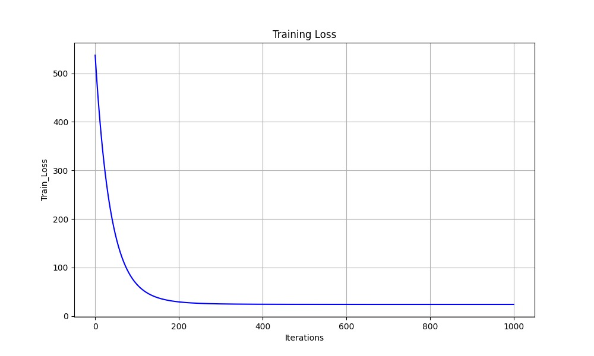
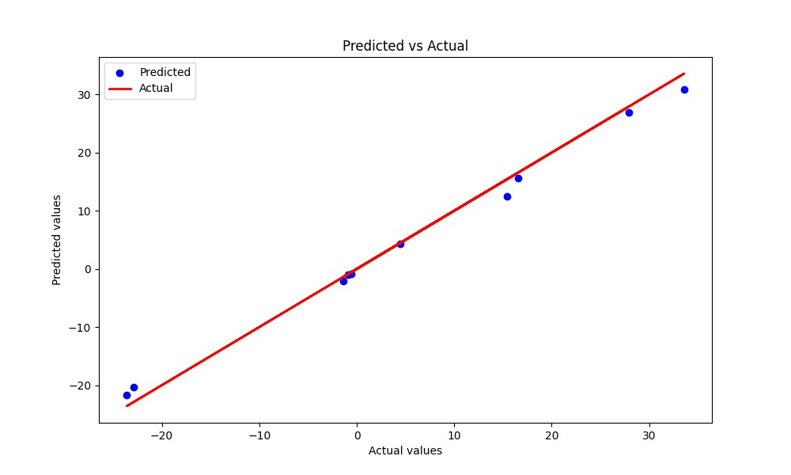
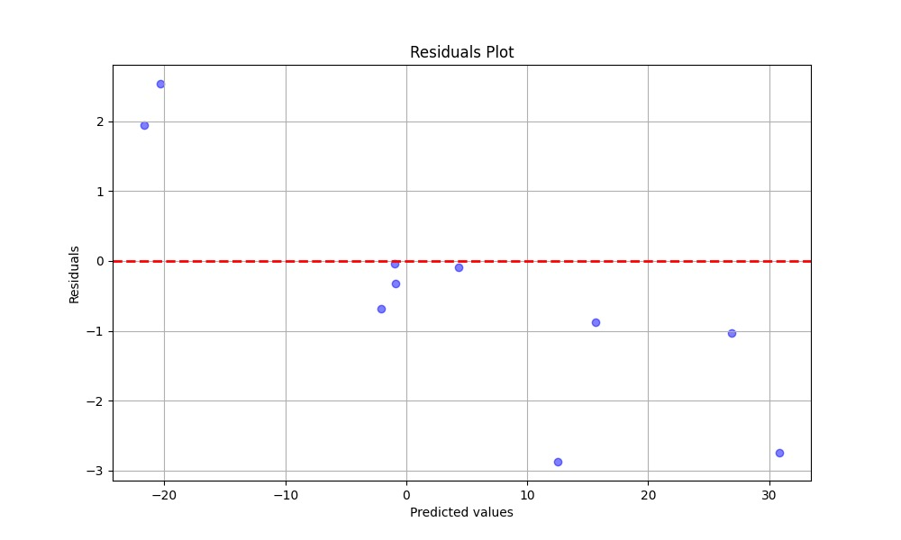
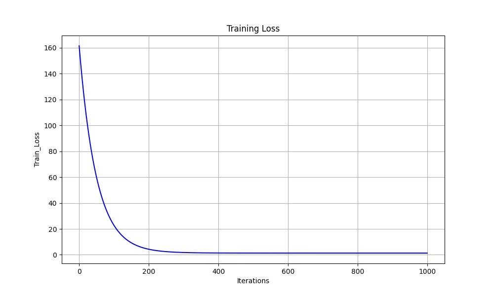
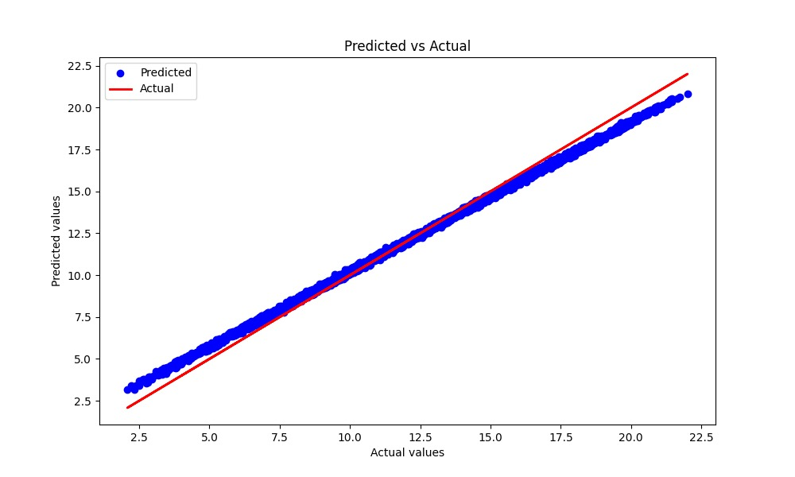
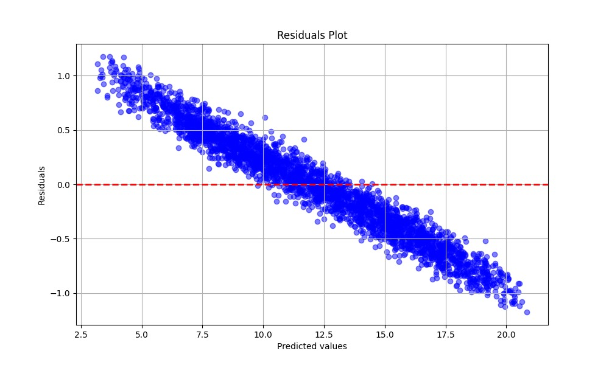

# Project 1 

# Group Members
* Sharan Rama Prakash Shenoy - A20560684
* Adarsh Chidirala - A20561069
* Venkata Naga Lakshmi Sai Snigdha Sri Jata - A20560684

# ###################################################
## Usage Instructions

### Installation

To get started with this project, first you need **Python 3.x**. Then follow these installation steps:

#### 1. Clone the Repository to your local machine:

```bash
git clone https://github.com/adarsh-chidirala/Project1.git
```
#### 2. You can install the required libraries using requirements.txt pip:

```bash
pip install -r requirements.txt
```
#### 3. Run the Test Script

```bash
# for windows
py -m elasticnet.tests.test_ElasticNetModel 

# or for mac
pytest -s elasticnet/tests/test_ElasticNetModel.py 
```
This will run the test cases and print out the evaluation metrics and generate the plots.

### Introduction
This project is an implementation of type of Linear Regression with ElasticNet regularization. This model is combination of two regularization techniques i.e; Lasso and Ridge regression. They are represented as L1 and L2 respectively.
  **L1 Regularization** : It adds up a penalty which is equal to the sum of the absolute values of the model coefficients. This helps in feature selection, as it enables the model to identify and retain only the most significant features by eliminating those with zero coefficients. 
  **L2 Regularization** : It adds up a penalty which is equal to the sum of the square values of the model coefficients. This helps in reducing the size of the coefficients, helping to prevent overfitting, particularly in situations where the features are strongly correlated.

### Usage of Elastic Net Regression

- **Initialization**: Start by creating an instance of `ElasticNetRegression`, where you can set parameters to manage the levels of regularization. This is important for optimizing the  complexity and ensuring performance.

- **Training**: Call the `fit` method to train the model using the dataset, which consists of input features and the output variable using training data set allocated. This step helps to learn and fine-tune the coefficients through the optimization of the Elastic Net loss function.

- **Prediction**: Once the model is done with training, you can use the `predict` method to obtain predictions on the test datasets. This allows the model to leverage the relationships it has learned to make accurate forecasts for data that it has not encountered before.


## i.What does the model you have implemented do and when should it be used?

# ElasticNet Model Overview

The **ElasticNet model** enhances linear regression by incorporating both L1 and L2 norms. It's particularly useful for:

- **Multicollinearity**: Reduces variance through L2 regularization when features are highly correlated.
- **Feature selection**: The L1 norm helps in zeroing out many feature coefficients, akin to selecting features.
- **Generalized regularization**: Combining Lasso (L1) and Ridge (L2) results offers a more adaptable solution.

## When to Use ElasticNet

- Handling high-dimensional data.
- Encountering multicollinearity among features.
- Seeking an optimal balance between bias and variance.

## ii. How did you test your model to determine if it is working reasonably correctly?
# Model Testing Process

The strengths of the model have been demonstrated through several test cases designed to ensure it behaves reasonably under different conditions:

1. **Standard dataset test**: We ran the model using a small test CSV file (`small_test.csv`) to check for reasonable predictions. Comparing actual and predicted values showed a good correlation.

2. **Zero variance test**: We used a dataset with a feature that had no variance (standard deviation equal to 0) to see if the model could handle this situation with finite and reasonable predictions.

3. **Highly correlated features test**: We tested the performance with highly correlated input features to see if ElasticNet could address multicollinearity effectively.

4. **Sparse data test**: Provided data with many zeros to verify that regularization works as expected.

5. **Outliers test**: Examined how the model behaved in the presence of outliers, aiming for bounded predictions and reasonable residual values.

6. **Large dataset test**: We used a large dataset to gauge the model's scalability and robustness.

7. **Alpha and L1 ratio variation**: Tried different combinations of `regularization_strength` and `l1_ratio` to understand their influence on the model's behavior.

8. **Non-normalized data test**: Checked the model on non-normalized data to ensure proper normalization during training.

Each test calculates **Mean Squared Error (MSE)**, **Mean Absolute Error (MAE)**, and **R-squared (R2)**. Additionally, **scatter** and **residual plots** are created to visualize the model's performance.


## iii.What parameters have you exposed to users of your implementation in order to tune performance? (Also perhaps provide some basic usage examples.)
# Tuning ElasticNet Model Parameters

The ElasticNet model exposes the following parameters for tuning performance:

- **regularization_strength**: Controls the degree of regularization applied. Higher values increase the penalty on model coefficients to reduce over-fitting.
- **l1_ratio**: Determines the mix between L1 (Lasso) and L2 (Ridge) regularization. A value of 0 corresponds to pure Ridge, 1 corresponds to pure Lasso, and values between 0 and 1 blend both methods.
- **max_iterations**: Sets the maximum number of iterations for the optimization algorithm.
- **tolerance**: Defines the threshold for convergence; the algorithm stops when changes in the coefficients are smaller than this value.
- **learning_rate**: Controls the step size during optimization, affecting the speed and stability of convergence.

These parameters can be adjusted by users to better match their datasets and improve model performance.

## Basic Usage Example

```python
class ElasticNetModel:
    def __init__(self, regularization_strength, l1_ratio, max_iterations, tolerance=1e-6, learning_rate=0.01):
        self.regularization_strength = regularization_strength
        self.l1_ratio = l1_ratio
        self.max_iterations = max_iterations
        self.tolerance = tolerance
        self.learning_rate = learning_rate
        
    def fit(self, X, y):
        # Fit the model using the training data
        pass
    
    def predict(self, X):
        # Predict using the fitted model
        pass

    def score(self, X, y):
        # Evaluate the model performance
        pass
```
```
# Example usage:
# model = ElasticNetModel(1.0, 0.5, 1000)
# model.fit(X_train, y_train)
# predictions = model.predict(X_test)
# score = model.score(X_test, y_test)
```

## iv. Are there specific inputs that your implementation has trouble with? Given more time, could you work around these or is it fundamental?

# Specific Inputs and Workarounds

## Specific Inputs:

- **Highly imbalanced datasets**: The ElasticNet model struggles with severe class imbalance or the presence of outliers, as they can heavily influence the regression line. This issue can be mitigated through proper outlier detection methods and basic preprocessing.

- **Non-linear relationships**: ElasticNet assumes a linear relationship between independent variables and the dependent variable. If the data exhibits complex non-linear patterns, the model's performance might degrade. Non-linear models or feature engineering could be considered for enhancements.

## Workarounds:

- **Imbalanced datasets**: Employ data resampling techniques, robust scaling, or apply transformations relevant to the problem domain to handle outliers more effectively.

- **Non-linear relationships**: Given more time, incorporating features such as polynomial feature generation or kernel-based approaches can help capture non-linearity, though it may increase the model's complexity.

### Output:
Ran with 2 datasets
## 1. Small_test.csv:
i.
    
ii.
    
iii.
    


## 2. data_long.csv:
i.
    
ii.
    
iii.
    
