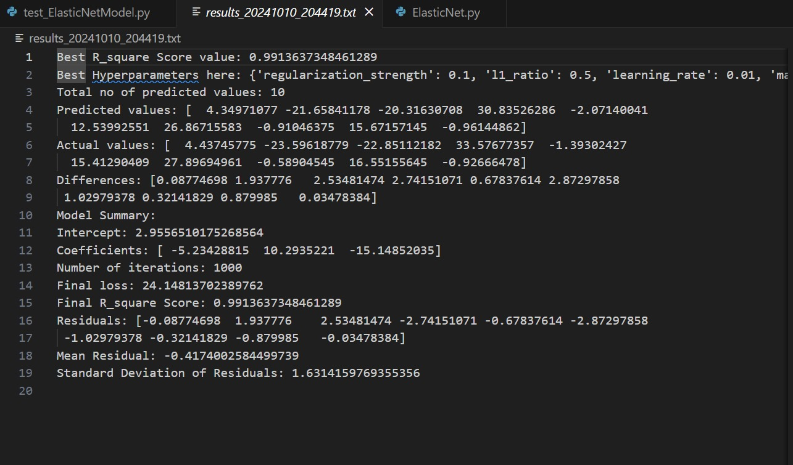
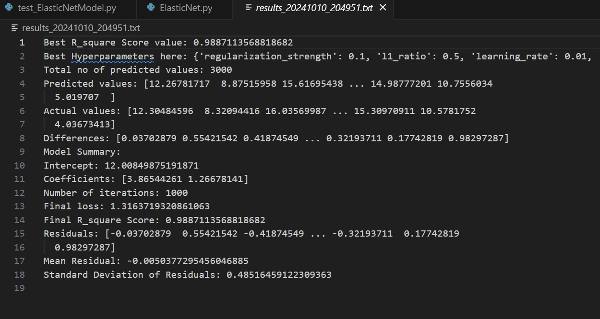

# Project 1 

# Group Members
* Sharan Rama Prakash Shenoy - A20560684
* Adarsh Chidirala - A20561069
* Venkata Naga Lakshmi Sai Snigdha Sri Jata - A20560684

# ###################################################
## Usage Instructions

### Installation

To get started with this project, first you need **Python 3.x**. Then follow these installation steps:

#### 1. Clone the Repository to your local machine:

```bash
git clone https://github.com/adarsh-chidirala/Project1.git
```
#### 2. You can install the required libraries using requirements.txt pip:

```bash
pip install -r requirements.txt
```
#### 3. Run the Test Script

```bash
# for windows
py -m elasticnet.tests.test_ElasticNetModel 

# or for mac
pytest -s elasticnet/tests/test_ElasticNetModel.py 
```
This will run the test cases and print out the evaluation metrics and generate the plots.

### Introduction
This project is an implementation of type of Linear Regression with ElasticNet regularization. This model is combination of two regularization techniques i.e; Lasso and Ridge regression. They are represented as L1 and L2 respectively.
  **L1 Regularization** : It adds up a penalty which is equal to the sum of the absolute values of the model coefficients. This helps in feature selection, as it enables the model to identify and retain only the most significant features by eliminating those with zero coefficients. 
  **L2 Regularization** : It adds up a penalty which is equal to the sum of the square values of the model coefficients. This helps in reducing the size of the coefficients, helping to prevent overfitting, particularly in situations where the features are strongly correlated.

### Usage of Elastic Net Regression

- **Initialization**: Start by creating an instance of `ElasticNetRegression`, where you can set parameters to manage the levels of regularization. This is important for optimizing the  complexity and ensuring performance.

- **Training**: Call the `fit` method to train the model using the dataset, which consists of input features and the output variable using training data set allocated. This step helps to learn and fine-tune the coefficients through the optimization of the Elastic Net loss function.

- **Prediction**: Once the model is done with training, you can use the `predict` method to obtain predictions on the test datasets. This allows the model to leverage the relationships it has learned to make accurate forecasts for data that it has not encountered before.


## i.What does the model you have implemented do and when should it be used?

# ElasticNet Model Overview

The **ElasticNet model** enhances linear regression by incorporating both L1 and L2 regression model techniques where L1 is the lasso regression and L2 is the ridge regression. It's particularly useful when we have data where we want to **balance out bias and variance values** or if we are **handling some high-dimensional data**.

The model we generated combines both L1 and L2 to give a better solution.We have more control as we can change the values of the hyperparameters which ensures that we can arrive at the best fit solution.


## ii. How did you test your model to determine if it is working reasonably correctly?
# Model Testing Process

The strengths of the model have been demonstrated through several test cases designed to ensure it behaves reasonably under different conditions:

1. **Standard dataset test**: We ran the model using a small test CSV file (`small_test.csv`) to check for reasonable predictions. Comparing actual and predicted values showed a good correlation. We also tried using a larger test CSV file (`data_long.csv`) so that we can check the accuracy by documenting the r_square values.

2. **Highly correlated features test**: We tested the performance with highly correlated input features to see if ElasticNet could address multicollinearity effectively.

3. **Alpha and L1 ratio variation**: Tried different combinations of `regularization_strength` and `l1_ratio` to understand their influence on the model's behavior.

4. We provided an option to change the grid paramenters so that the user can uncomment and use any one of them according to the need to test large data sets with more accuracy we have provided a small grid parameters where we can compute it in 5 to 6 s while the large grid parameter option takes around 5 mins to compute for 3000 lines of data which is 0.2 of the total.

Each test calculates **Mean Squared Error (MSE)**, **Mean Absolute Error (MAE)**, and **R-squared (R2)**. Additionally, **scatter** and **residual plots** are created to visualize the model's performance.


## iii.What parameters have you exposed to users of your implementation in order to tune performance? (Also perhaps provide some basic usage examples.)
# Tuning ElasticNet Model Parameters

The ElasticNet model exposes the following parameters for tuning performance:

- **regularization_strength**: Controls the degree of regularization applied. Higher values increase the penalty on model coefficients to reduce over-fitting.
- **l1_ratio**: Determines the mix between L1 (Lasso) and L2 (Ridge) regularization. A value of 0 corresponds to pure Ridge, 1 corresponds to pure Lasso, and values between 0 and 1 blend both methods.
- **max_iterations**: Sets the maximum number of iterations for the optimization algorithm.
- **tolerance**: Defines the threshold for convergence; the algorithm stops when changes in the coefficients are smaller than this value.
- **learning_rate**: Controls the step size during optimization, affecting the speed and stability of convergence.

## Additional Code Explanation
- These parameters can be adjusted by users to better match their datasets and improve model performance.
- We have divided the data into two parts where 80 % of the data is for Training and 20 % is for testing the data.
- We have written code where the results are also documented seperately in a file called "Results.txt" where the results for the specific test run is stored.
- We are also storing the plot images to the directory for reference and comparison.
- We included a definition called `ml_grid_search` to ensure that the hyperparameters can be changed accorfding to user requirement and so that the best fit model can be decided based on which hyperparameters.

## Basic Usage Example

```python
    # This is for large grid parameter variations
     regularization_strength_values = [0.01, 0.1, 0.5, 1.0, 5.0]
     l1_ratio_values = [0.1, 0.2, 0.5, 0.7, 0.9]
     learning_rate_values = [0.001, 0.01, 0.1]
     max_iterations_values = [500, 1000, 2000]
    
    # This is for small grid parameter variations
    regularization_strength_values = [0.1, 0.5]
    l1_ratio_values = [0.1, 0.5]
    learning_rate_values = [0.01]
    max_iterations_values = [1000]
```

## iv. Are there specific inputs that your implementation has trouble with? Given more time, could you work around these or is it fundamental?

# Specific Inputs and Workarounds

## Specific Inputs:

- **Data Set With Variation Of Data**: We had a fundamental issue with the specific orientation and data arrangement of the data which caused errors during runtime.

- **Hyperparameters**: We faced issues when we use less parameters for tuning which created less variation and less data for the model to test on, as well as presented an issue when we used more parameters it took long time to compile for example, 3000 lines of data training the model on 1000 iterations with 200+ choices of hyperparameters.

## Workarounds:

- **Data Set With Variation Of Data**: We Employed concept of Preprocessing the data where we understood the data which was going to be used and preprocessed the data by including a direct OS path and Specification of how the data was read and intepreted by the model.

- **Choice of Hyperparameters**: Given more time, We added more choices in the hyperparemeters and made it more user controlled, We also esured that all the choices were considered the best fit for the model was also displayed. Incorporating features such as polynomial feature generation and plots helped us analyse the respective outputs.

### Output:
Ran with 2 datasets
## 1. Small_test.csv:
i.
    
ii.
    
iii.
    
iv. 
    

## 2. data_long.csv:
i.
    
ii.
    
iii.
    
iv. 
    
